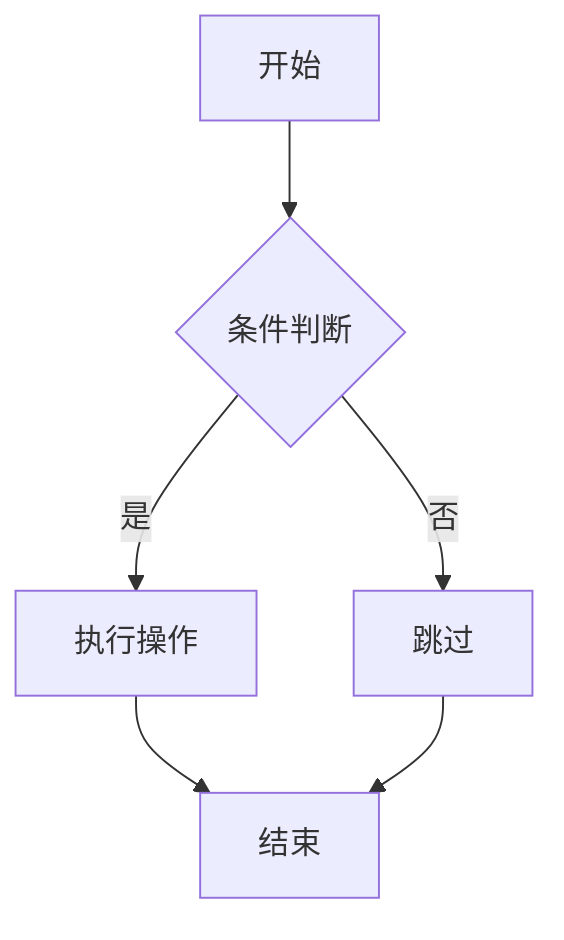
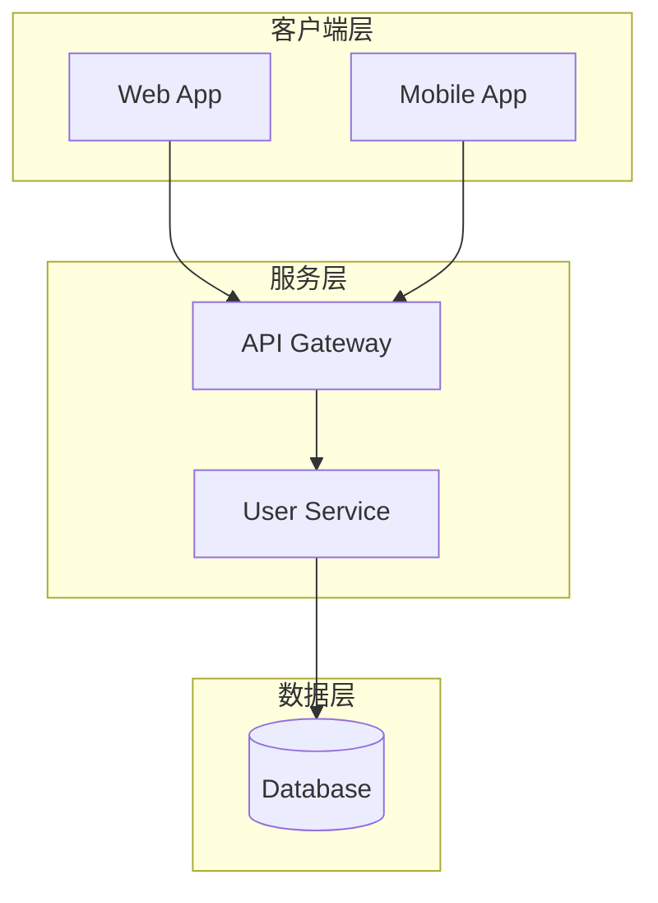

# code-to-diagram

分析源代码逻辑，生成包含 Mermaid 流程图的 Markdown 文件并渲染为 PNG 图片。

## 功能特性

- 支持多种图表类型：流程图、状态机、时序图、架构图、ER图等
- 自动分析代码结构，生成可视化图表
- 输出高清 PNG 图片（默认 3x 缩放）
- 同时生成可编辑的 Mermaid 源码文件
- 支持多种主题：default、forest、dark、neutral

## 安装

### 前置要求

- Node.js 16+（包含 npx）
- mermaid-cli（可选，脚本会自动通过 npx 调用）

### 作为 Claude Code Skill 使用

将本项目克隆到 Claude 的 skills 目录：

```bash
git clone https://github.com/zhouchang1988/code-to-diagram.git ~/.claude/skills/code-to-diagram
```

## 使用方法

### 基本用法

```bash
node ~/.claude/skills/code-to-diagram/scripts/code_to_diagram.js render \
  --file /path/to/diagram.mmd \
  --name output_name \
  --output-dir /path/to/output
```

### 命令行参数

| 参数 | 简写 | 说明 | 默认值 |
|------|------|------|--------|
| `--content` | `-c` | Mermaid 源码字符串 | - |
| `--file` | `-f` | .mmd 文件路径（推荐） | - |
| `--name` | `-n` | 输出文件基础名 | diagram |
| `--output-dir` | `-o` | 输出目录 | 当前目录 |
| `--theme` | `-t` | 主题 (default/forest/dark/neutral) | dark |
| `--width` | `-W` | 画布宽度（像素） | 2400 |
| `--height` | `-H` | 画布高度（像素） | 4000 |
| `--scale` | `-s` | 缩放系数 | 3 |
| `--bg` | `-b` | 背景颜色 | #0d1117 |

## 支持的图表类型

| 图表类型 | Mermaid 语法 | 适用场景 |
|---------|-------------|---------|
| 流程图 | `flowchart TD/LR/TB` | 控制流、业务流程 |
| 状态图 | `stateDiagram-v2` | 状态机、工作流 |
| 时序图 | `sequenceDiagram` | 接口调用、消息传递 |
| 类图 | `classDiagram` | 类继承关系 |
| ER图 | `erDiagram` | 实体关系 |
| 架构图 | `flowchart TB + subgraph` | 系统架构、分层架构 |

## 示例

### 流程图示例



### 架构图示例



## 输出文件

执行后会生成两个文件：

- `<name>.md` - 包含 Mermaid 源码的 Markdown 文档
- `<name>.png` - 渲染后的高清图片

## 依赖

- [mermaid-cli](https://github.com/mermaid-js/mermaid-cli) - Mermaid 命令行渲染工具

脚本会自动检测系统中的 `mmdc` 命令，未找到时会通过 `npx` 自动调用。

## License

MIT
