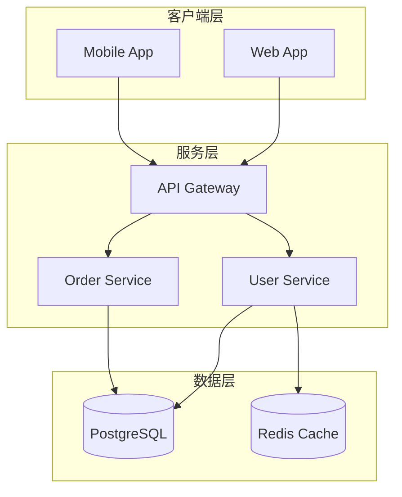
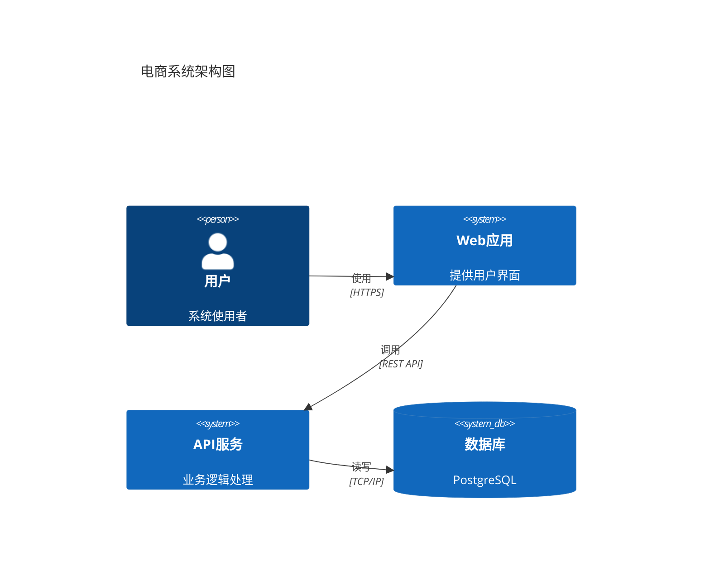

# Code-to-Diagram Skill

分析指定目录或文件的源代码，提取控制流 / 数据流逻辑，输出两个文件：

1. **Markdown 文档**（`.md`）：包含 Mermaid 源码（可在支持 Mermaid 的编辑器 / GitHub 中直接预览）
2. **渲染后的 PNG 图片**（高清）

两个文件默认保存在当前工作目录，也可通过 `--output-dir` 指定任意目录。

---

## Claude 使用本 Skill 的步骤

### 第一步 —— 读取并分析代码

使用 `Read`、`Glob`、`Grep` 工具理解代码结构，识别主要逻辑模式：

| 代码模式 | 推荐 Mermaid 图表类型 |
|---------|----------------------|
| 状态机 / 工作流 | `flowchart TD` 或 `stateDiagram-v2` |
| 类继承关系 | `classDiagram` |
| 接口 / 消息传递 | `sequenceDiagram` |
| 实体关系 | `erDiagram` |
| 简单流程 | `flowchart LR` |
| **系统架构 / 分层架构** | **`flowchart TB` + `subgraph`** |
| **微服务架构** | **`flowchart TB` + `subgraph` 或 `C4Container`** |
| **部署架构** | **`flowchart TB`** |

**识别架构图的信号**：
- 用户明确要求"架构图"、"系统图"、"部署图"、"服务拓扑"
- 代码有多层目录结构（如 `controllers/`、`services/`、`models/`、`repositories/`）
- 代码有微服务边界或模块间调用
- 需要展示系统组件及其依赖关系

### 第二步 —— 生成 Mermaid 源码

根据分析结果，编写完整的 Mermaid 图表源码。

**重要：语言规则**
- 图表中的文字描述**必须使用中文**，包括节点标签、连线说明、注释等。
- 以下内容保留原文（不翻译）：代码中的类名、函数名、变量名、枚举值、协议名等专有标识符。
- 示例：
  - 正确：`A["初始化 TaskManager"] --> B{"检查 isRunning 状态"}`
  - 错误：`A["Initialize TaskManager"] --> B{"Check isRunning status"}`

**重要：换行规则**
- 如果需要在节点文本 / 标签中显示多行文字，**必须使用 `<br/>` 而不是 `\n`**。
  - 正确：`A["第一行<br/>第二行"]`
  - 错误：`A["第一行\n第二行"]`
- Mermaid 语句之间用正常的换行分隔即可。

### 第三步 —— 写入 .mmd 文件并调用渲染脚本

**推荐方式**：先用 `Write` 工具将 Mermaid 源码写入 `.mmd` 文件，然后用 `--file` 参数调用渲染脚本。这样可以避免 shell 转义问题，也能正确处理各种特殊字符。

```bash
node ~/.claude/skills/code-to-diagram/scripts/code_to_diagram.js render \
  --file <路径/diagram.mmd> \
  --name <输出文件基础名> \
  --output-dir <保存目录>
```

也可以用 `--content` 传入内联源码（脚本会自动将字面 `\n` 转换为真正换行）：

```bash
node ~/.claude/skills/code-to-diagram/scripts/code_to_diagram.js render \
  --content "<mermaid 源码>" \
  --name    <输出文件基础名，不含扩展名> \
  --output-dir <保存目录>
```

脚本执行完毕后，最后一行输出 JSON，包含两个输出文件的绝对路径：

```json
{"md":"/workspace/project/task_flow.md","png":"/workspace/project/task_flow.png"}
```

### 第四步 —— 展示图片给用户

使用 `Read` 工具读取 `.png` 路径，将渲染好的图片内联展示在对话中。

---

## 命令行参数说明

```
node code_to_diagram.js render [选项]

选项：
  --content,    -c  <字符串>   Mermaid 源码（与 --file 二选一）
  --file,       -f  <路径>     已有的 .mmd 文件路径（与 --content 二选一，推荐）
  --name,       -n  <字符串>   输出文件基础名，不含扩展名（默认：diagram）
  --output-dir, -o  <路径>     输出目录（默认：当前工作目录，不存在时自动创建）
  --theme,      -t  <主题>     default | forest | dark | neutral（默认：dark）
  --width,      -W  <像素>     画布宽度（默认：2400）
  --height,     -H  <像素>     画布高度（默认：4000）
  --scale,      -s  <倍数>     Puppeteer 缩放系数（默认：3）
  --bg,         -b  <颜色>     背景颜色（默认：#0d1117）
  --help,       -h             显示帮助信息
```

---

## 依赖说明

本 Skill 依赖 **mermaid-cli**（`mmdc`）。

脚本会自动查找系统中的 `mmdc`。如果未找到，会自动通过 `npx` 调用，无需手动安装。
前提是系统中已有 **Node.js**（包含 npx）。

---

## 使用示例

### 推荐方式：先写文件再渲染

Claude 先用 Write 工具创建 `.mmd` 文件，然后调用脚本渲染：

```bash
node ~/.claude/skills/code-to-diagram/scripts/code_to_diagram.js render \
  --file /workspace/myproject/state_machine.mmd \
  --name state_machine \
  --output-dir /workspace/myproject
```

### 用亮色主题重新渲染已有的 .mmd 文件

```bash
node ~/.claude/skills/code-to-diagram/scripts/code_to_diagram.js render \
  --file /workspace/myproject/state_machine.mmd \
  --theme default \
  --bg white \
  --output-dir /workspace/myproject
```

### 绘制系统架构图

使用 `flowchart TB` + `subgraph` 绘制分层架构：



使用 C4 Model 绘制标准化架构图（需要 mermaid-cli 10.6+）：



---

## 输出文件说明

| 文件 | 说明 |
|------|------|
| `<输出目录>/<名称>.md` | 包含 Mermaid 源码的 Markdown 文档，可在 GitHub / 编辑器中直接预览图表 |
| `<输出目录>/<名称>.png` | 高分辨率渲染图片（默认 scale=3，有效分辨率 7200×12000） |
